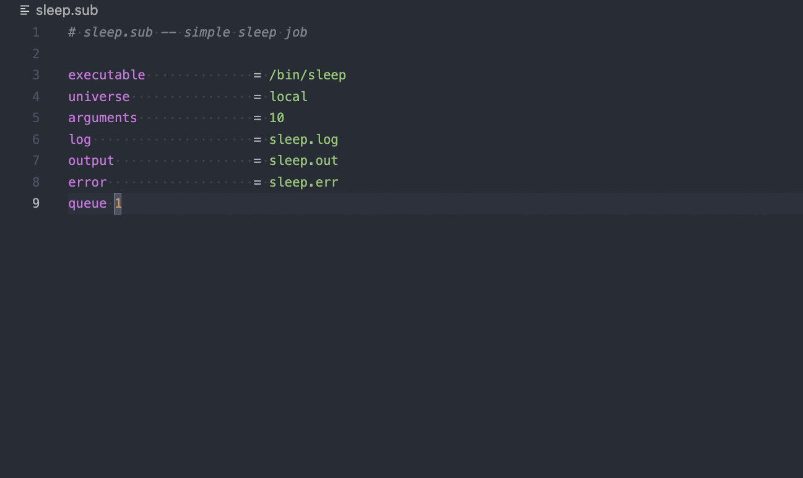
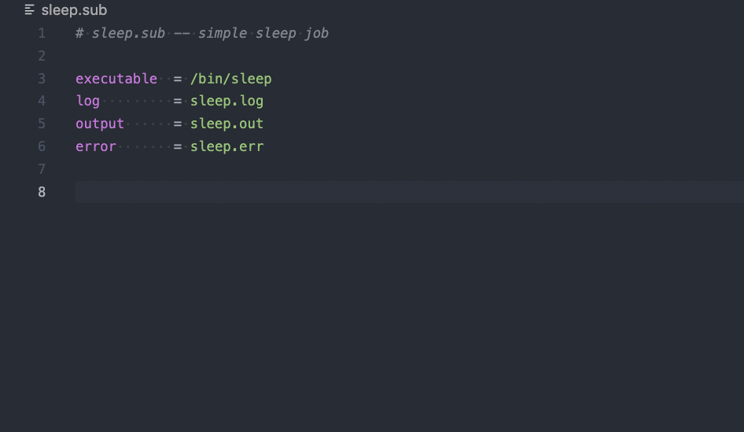

# Htcondor for Visual Studio Code

The Htcondor extension for Visual Studio Code adds rich language support for the Htcondor submit. files. Future releases will include more features for interacting with access points and jobs.

## Features

- Submit file commands documentation on hover

  

- Submit file commands documentation on completion

  

- Submit file snippets

  

- Syntax highlighting

## Requirements

Submit files must end in `.sub` for language support to be enabled.

## Extension Settings

Include if your extension adds any VS Code settings through the `contributes.configuration` extension point.

For example:

This extension contributes the following settings:

* `myExtension.enable`: Enable/disable this extension.
* `myExtension.thing`: Set to `blah` to do something.

## Known Issues

## Release Notes

With each release, the following will be updated:

### 1.0.0

Initial release of Htcondor for Visual Studio Code

## Contributing

Open an issue or submit a pull request.

## License
